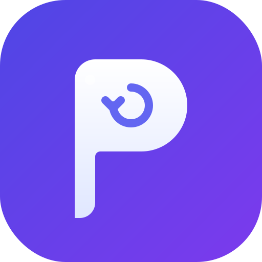

# 🧩 Retrieplug (Retrieve-Plugin)

> **"Transforming linear AI chats into your personal knowledge tree."**
> **"将线性的 AI 对话转变为你的个人知识树。"**

---

## 🌲 Why Retrieplug? / 为什么选择 Retrieplug？

** Standard AI interfaces force you to scroll endlessly. If your thought process is non-linear—branching off into technical details and then returning to the main topic—you lose context. **Retrieplug** allows you to anchor important answers and jump between different "branches" of your conversation via a persistent sidebar.

** 标准的 AI 聊天界面强迫用户进行线性滚动。如果你的思维是非线性的（例如在深入探讨技术细节后需要返回主旨），你很容易丢失上下文。**Retrieplug** 允许你锚定重要的回答，并通过侧边栏在不同的思维“分支”间瞬间穿梭。

---

## 🧠 Memory System / 记忆存储系统

We have implemented a robust dual-mode storage system to ensure your "Knowledge Tree" is always safe and accessible.  
我们实现了强大的双模存储系统，确保你的“知识树”始终安全且易于访问。

### 1. Auto-Save (Persistence) / 自动存储（持久化）
* The extension automatically syncs your pinned messages to `chrome.storage.local` based on the unique conversation URL. Even if you refresh the page or restart your browser, your pins remain intact.
* 插件会根据唯一的会话 URL 自动将你固定的消息同步到 `chrome.storage.local`。即使刷新页面或重启浏览器，你的锚点记录依然存在。

### 2. Manual Control / 手动管理
* You have full control over the memory. Manually pin messages using the 📌 button on hover, or remove specific snippets directly from the sidebar. The storage updates in real-time.
* 用户拥有对记忆的完全控制权。你可以通过悬停时显示的 📌 按钮手动固定消息，或者直接在侧边栏中移除片段，存储数据会实时更新。

---

## ✨ Features / 核心功能

* **📌 Smart Pinning / 智能固定**: Hover over any AI response to instantly anchor it. (鼠标悬停 AI 回答即可瞬间锚定。)
* **📋 Snippet Sidebar / 侧边栏索引**: A sleek, collapsible drawer with a glassmorphism design. (美观的可折叠侧边栏，采用毛玻璃视觉设计。)
* **⚡ Instant Warp / 瞬间穿梭**: Click any card in the sidebar to smoothly scroll to that message. (点击卡片即可平滑滚动回原始对话位置。)
* **🎨 Optimized Icon / 优化图标**: Featuring the "Retrieval Eye" – a symbol of retrieval and anchoring. (采用“回溯之眼”标志，象征检索与固定。)

---

## 🚀 Installation / 安装指南

1.  **Download/Clone** this repository to your local machine. (下载或克隆本仓库到本地。)
2.  Open Chrome and navigate to `chrome://extensions/`. (打开 Chrome 并前往 `chrome://extensions/`。)
3.  Enable **Developer mode** in the top-right corner. (开启右上角的 **开发者模式**。)
4.  Click **Load unpacked** and select the `Retrieplug` folder. (点击 **加载已解压的扩展程序** 并选择项目文件夹。)
5.  Refresh your AI conversation page to start. (刷新 AI 会话页面即可开始使用。)

---

## 🗺️ Roadmap / 开发路线图

- [x] Persistent Memory Storage (Local). / 持久化本地存储。
- [x] Auto & Manual Memory Management. / 自动与手动记忆管理。
- [ ] Multi-platform support (ChatGPT, Gemini, DeepSeek). / 多平台支持。
- [ ] Export pins as Markdown / PDF. / 将锚点导出为 Markdown 或 PDF。
- [ ] Grouping/Folders for complex thought branches. / 为复杂的思维分支建立分组或文件夹。

---

## 📄 License / 许可证

Distributed under the **Apache-2.0 License**. See `LICENSE` for more information.  
本项目采用 **Apache-2.0 许可证** 开源。详情请参阅 `LICENSE` 文件。

---
